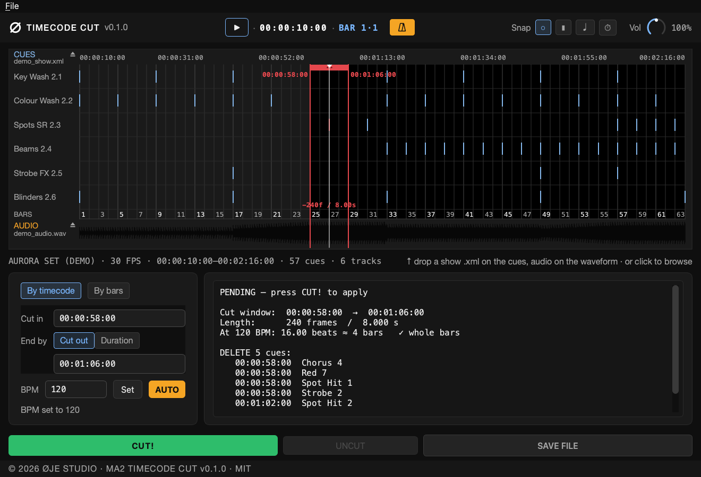
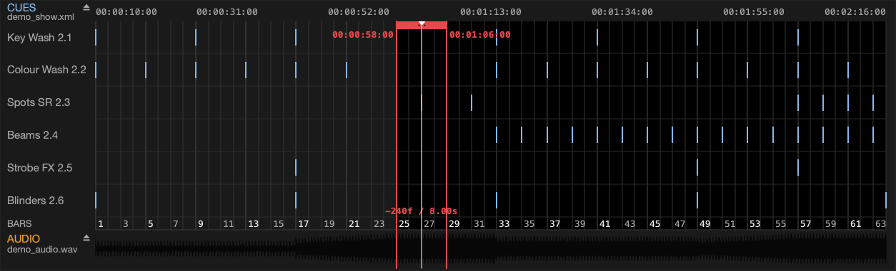

# ma2-tc-cut

Ripple cut (remove a chunk and slide the rest left, like *cut time* in Ableton)
for **grandMA2** timecode shows — straight in the exported XML, **byte-for-byte
safe**, with zero dependencies.

```
python3 ma2_tc_cut.py SHOW.xml SHOW_cut.xml --cut-in 06:31:14:21 --cut-out 06:31:26:07
```

---

## Why

When a section gets cut out of a song (say, an extra chorus pass), the timecode
show has to collapse with it: delete the cues that fall inside the removed window,
and pull everything after it left by the length of the cut. Doing that by hand in
the timecode editor is slow and error-prone. This tool does the ripple across every
subtrack at once and writes the file back so grandMA2 re-imports it without complaints.

## The one thing to know about the format

`<Event time="...">` stores a **frame number**, not milliseconds. The unit is
`1 / frame_format`. At `frame_format="30 FPS"` a 30-second cut is **900 frames**,
not 30000. The fps is read from the file automatically — on a 25fps show the tool
picks up 25 with no changes.

## Install

Nothing to install. Python 3, standard library only. Copy `ma2_tc_cut.py` and you're
done. Deliberately no `lxml`, so it runs on a show laptop / MA onPC machine where pip
and a compiler usually aren't available.

## Desktop app (macOS & Windows)

Prefer a UI over the command line? There's a PySide6 desktop app:



- **Timeline** of every cue across subtracks, with a BPM **bar grid** and a
  **waveform** of the song under it (drag-and-drop, or click, to load the `.xml`
  and the audio).
- **Cut by timecode or by bars** (from bar N, remove M bars), with a live preview
  of exactly which cues get deleted/shifted and a whole-bars warning.
- **Play / scrub** the audio with a moving playhead, and a **sample-accurate
  metronome** mixed into the stream (instant on/off, no drift).
- **CUT! → verify → UNCUT / SAVE FILE**: apply the cut to the working file, check
  it on the timeline, undo if wrong, then write a byte-exact XML.



It's a layer on top of the same core; the CLI below stays dependency-free for
show laptops.

**Download** a prebuilt build for macOS or Windows from the
[Releases](https://github.com/oje-studio/ma2-tc-cut/releases) page.

### First launch — clearing the quarantine

The builds are **unsigned and un-notarized** (no paid Apple/Microsoft developer
certificate), so the OS quarantines them on download. This is expected — here's
how to get past it.

**macOS** — if you get *"MA2 Timecode Cut" is damaged and can't be opened* or
*…can't be opened because it is from an unidentified developer*, the app isn't
actually broken; it's just quarantined. Do **one** of:

- **Right-click the app → Open**, then *Open* in the dialog (needed only once), **or**
- strip the quarantine flag in Terminal, then open it normally:

  ```
  xattr -dr com.apple.quarantine "/Applications/MA2 Timecode Cut.app"
  ```

  Point the path at wherever the app lives (e.g. `~/Downloads/"MA2 Timecode Cut.app"`).
  Use this if right-click → Open doesn't appear. **Or**
- open it once, then go to **System Settings → Privacy & Security → Open Anyway**.

**Windows** — on the blue **SmartScreen** prompt click **More info → Run anyway**.
(Or right-click the `.exe` → *Properties* → tick **Unblock** → *OK* before launching.)

**Run from source** (no quarantine, always works):

```
pip install -r requirements-gui.txt
python gui.py
```

**Build it yourself** (PyInstaller can't cross-compile — build macOS on a Mac,
Windows on Windows; CI does both via `.github/workflows/build.yml`):

```
pip install -r requirements-gui.txt
pyinstaller --noconfirm MA2TimecodeCut.spec   # -> dist/
```

The app icon ships pre-built in `assets/` (`.icns` for macOS, `.ico` for
Windows). To regenerate it after editing the source, run
`python assets/build_icon.py` (needs Pillow, already in `requirements-gui.txt`).

The CLI below stays dependency-free for show laptops; the GUI is just a layer on
top of the same core.

## Export from grandMA2

The tool operates on the XML that grandMA2 exports from a **Timecode pool** object.

**Command line** (one line, unambiguous):

```
Export Timecode 14 "tc_show"
```

- `14` — the number of the Timecode pool object to export.
- `"tc_show"` — output filename, **without** extension (MA appends `.xml`).

grandMA2 writes the file into the **`gma2/importexport`** folder on the currently
selected drive (internal, USB, or the onPC data folder). Copy `tc_show.xml` from there
to the machine where you run this tool — USB stick, network share, or directly from the
onPC folder.

> GUI alternative: in the Timecode pool you can also export via the object's edit/menu,
> but the command line above is a single unambiguous line.

## Usage

```
python3 ma2_tc_cut.py <infile.xml> <outfile.xml> --cut-in <TC> (--cut-out <TC> | --dur <seconds>)
```

- `--cut-in HH:MM:SS:FF` — start of the cut, **absolute** timecode (as stored in the file).
- `--cut-out HH:MM:SS:FF` — end of the cut. **Frame-accurate, no rounding — preferred.**
- `--dur <seconds>` — length of the cut in seconds (rounded to frames). Defaults to 30.

The cut window is the half-open interval `[cut_in; cut_out)`: an event exactly on
`cut_out` is kept and shifted; one exactly on `cut_in` is removed.

Example output:

```
fps=30  cut 06:31:14:21 .. 06:31:26:07  (346 frames / 11.533s)
deleted events in window: 9   shifted left: 46
  DEL 06:31:16:05  Tambora CH In 6
  ...
```

The original is never touched — a new file is written.

## ⚠️ Musical correctness (the real gotcha)

The tool moves **light**, not audio. The cut lands "on the beat" only if:

1. **The cut mirrors the audio edit.** Cut the light with the same `[cut_in; cut_out)`
   window as the track. If the audio wasn't cut (or was cut at a different point / by a
   different length), light and music drift apart.
2. **The length is a whole number of bars/beats, not round seconds.** A musical splice
   always lands on the bar grid. "14.000 s" is almost never a whole number of bars — e.g.
   at ~84 BPM that's 19.5 beats, half a beat off, and everything after the cut is off the
   beat. Think in bars. (4 bars at 84 BPM ≈ 346 frames ≈ 11.5 s.)
3. **Put the in-point on a downbeat.** `cut_in` must land on a real beat, not on a "round"
   second between hits.

Hint: moments where several subtracks fire at the same time are almost always downbeats.
The spacing between them lets you estimate the bar grid and pick clean cut edges.

## Import back into grandMA2

Import syntax puts the **filename first** (that's the "NAME"), destination after; the
`.xml` extension is **not** written (MA adds it):

```
Import "SHOW_cut" At Timecode 40
```

`Import Timecode 40 "..."` gives `Error #12: EXPECTED NAME` — the argument order is the
reverse of `Export`. Import into an empty slot, keep the original as a backup, and check
the length.

## What is preserved byte-for-byte

Only the `index`/`time` attributes on `<Event>` lines change, and whole
`<Event>…</Event>` blocks are removed. Untouched: BOM, XML declaration,
`<?xml-stylesheet?>`, namespace and `xsi:schemaLocation`, the `command`/`pressed`/`step`
attributes, cue names, indentation (tabs), line endings (LF/CRLF), and the absence of a
trailing newline. `index` is renumbered 0-based within each subtrack; `step` is left alone.

## Verify

```
python3 selftest.py
```

Runs a cut on `examples/demo_tc.xml` (synthetic, no real show data) and checks: ripple
correctness, renumbering, monotonicity, BOM preservation, `--cut-out` ≡ `--dur`
equivalence, and that only `<Event>` lines changed.

## Limitations

- Moves timecode events only. Cue fade times and the audio are on you.
- Doesn't "stitch" light across the seam: whatever lands in the window is deleted (that's
  what cutting is).
- Built for the grandMA2 export structure (`<Timecode>/<Track>/<SubTrack>/<Event>`), one
  `<Cue>` per event. grandMA3 uses a different format.

## License

MIT — see [LICENSE](LICENSE).
